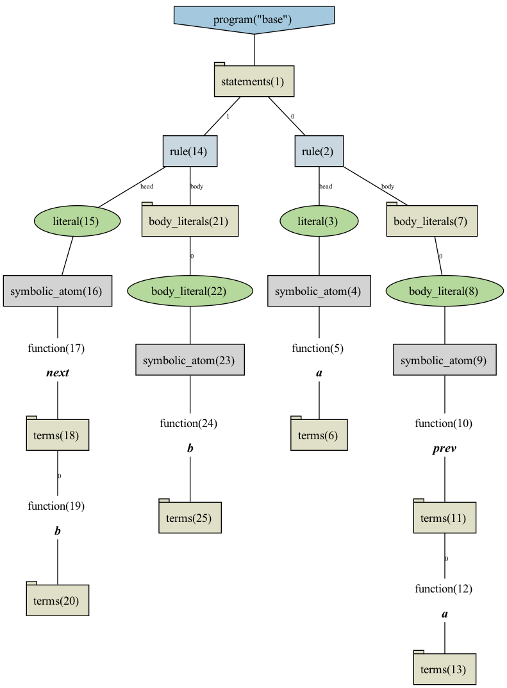
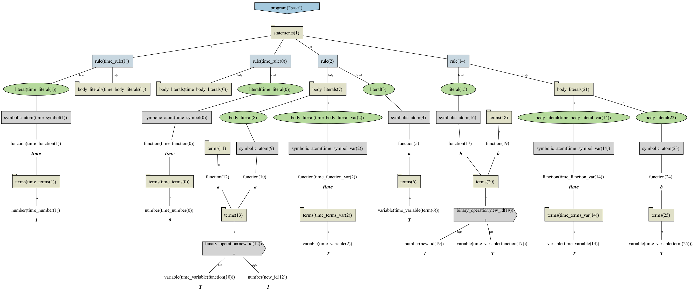

# Telingo example

## Basic usage 

### Input

```
a:- prev(a).
next(b):- b.
```

### Output

```shell
renopro examples/telingo/instance.lp reify | renopro transform --meta-encoding examples/telingo/transformer.lp --input-format=reified > examples/telingo/final.lp
```

```
#program base.
a(T) :- a((T-1)); time(T).
b((T+1)) :- b(T); time(T).
time(0).
time(1).
```

## Visualize instance

Save the reified output 

```shell
renopro examples/telingo/instance.lp reify > examples/telingo/reified.lp
```

Visualize with clingraph

```shell
clingraph examples/telingo/reified.lp --viz src/renopro/asp/viz.lp --out=render --view --format png --name-format="instance"
```



## Visualize result after transformation 

```shell
renopro examples/telingo/instance.lp reify | renopro transform --meta-encoding examples/telingo/transformer.lp --input-format=reified --output-format=reified > examples/telingo/final-reified.lp
```

Visualize with clingraph

```shell
clingraph examples/telingo/final-reified.lp --viz src/renopro/asp/viz.lp --out=render --view --format png --name-format="final"
```


