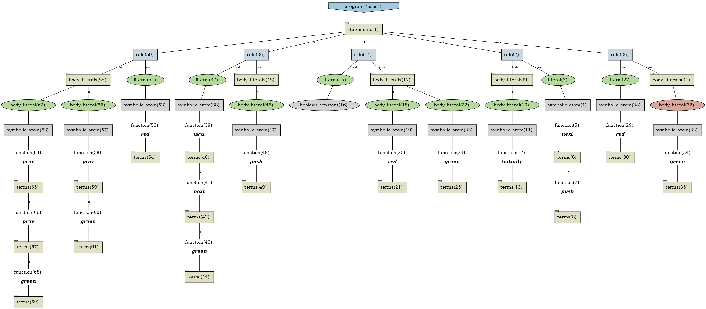
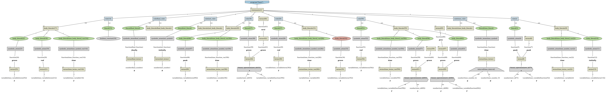

# Telingo example

## Basic usage 

### Input

```
next(push) :- initial.

:- red, green.
red :- not green.
next(next(green)):- push.
red :- prev(green), prev(prev(green)).
```

### Output

```shell
renopro reify examples/telingo/lights/instance.lp | renopro transform --meta-encoding examples/telingo/transformer.lp  --input-format=reified --clingo-options -c horizon=6 > examples/telingo/lights/final.lp
```

```
#program base.
push((T+1)) :- initially(T); time(T).
#false :- red(T); green(T); time(T).
red(T) :- not green(T); time(T).
green((T+2)) :- push(T); time(T).
red(T) :- green((T-1)); green((T-2)); time(T).
time(0).
time(1).
time(2).
time(3).
time(4).
time(5).
time(6).
initially(0).
finally(6).
```

### Run clingo to get a plan 

```shell
clingo examples/telingo/lights/final.lp
```
```
pyclingo version 5.6.2
Reading from examples/telingo/lights/final.lp
Solving...
Answer: 1
time(0) time(1) time(2) time(3) time(4) time(5) time(6) initially(0) push(1) green(3) red(0) red(1) red(2) red(4) red(5) red(6) finally(6)
SATISFIABLE

Models       : 1+
Calls        : 1
Time         : 0.000s (Solving: 0.00s 1st Model: 0.00s Unsat: 0.00s)
CPU Time     : 0.000s
```


## Visualize instance


```shell
renopro reify examples/telingo/lights/instance.lp | clingraph  --viz src/renopro/asp/viz.lp --out=render --view --format png --name-format="instance" --dir=examples/telingo/lights
```



## Visualize result after transformation 

```shell
renopro reify examples/telingo/lights/instance.lp | renopro transform --meta-encoding examples/telingo/transformer.lp --input-format=reified --output-format=reified  --clingo-options -c horizon=6 | clingraph --viz src/renopro/asp/viz.lp --out=render --view --format png --name-format="final" --dir=examples/telingo/lights
```



