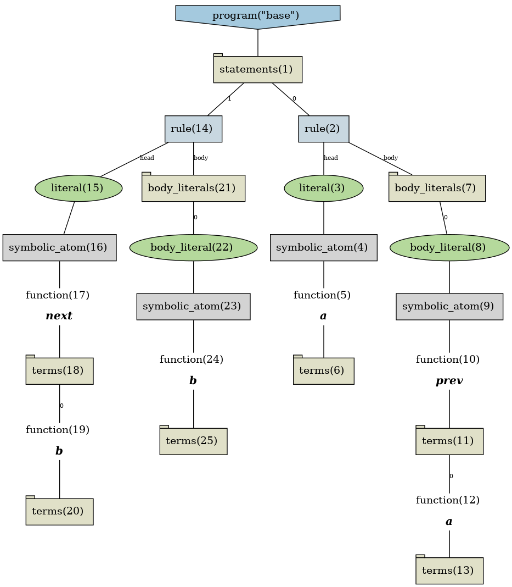
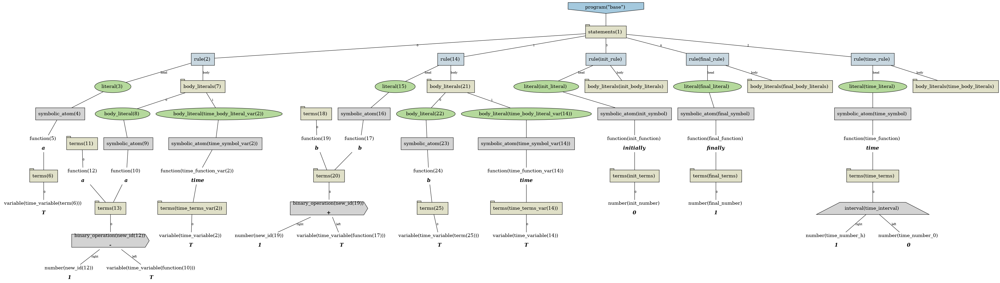

# Telingo example

## Basic usage 

### Input

```
a:- prev(a).
next(b):- b.
```

### Output

```shell
renopro reify examples/telingo/simple/instance.lp | renopro transform --meta-encoding examples/telingo/transformer.lp  --input-format=reified  > examples/telingo/simple/final.lp
```

```
#program base.
a(T) :- a((T-1)); time(T).
b((T+1)) :- b(T); time(T).
time((0..1)).
initially(0).
finally(1).
```

## Visualize instance


```shell
renopro reify examples/telingo/simple/instance.lp | clingraph  --viz src/renopro/asp/viz.lp --out=render --view --format png --name-format="instance" --dir=examples/telingo/simple
```



## Visualize result after transformation 

```shell
renopro reify examples/telingo/simple/instance.lp | renopro transform --meta-encoding examples/telingo/transformer.lp --input-format=reified --output-format=reified  | clingraph --viz src/renopro/asp/viz.lp --out=render --view --format png --name-format="final" --dir=examples/telingo/simple
```



